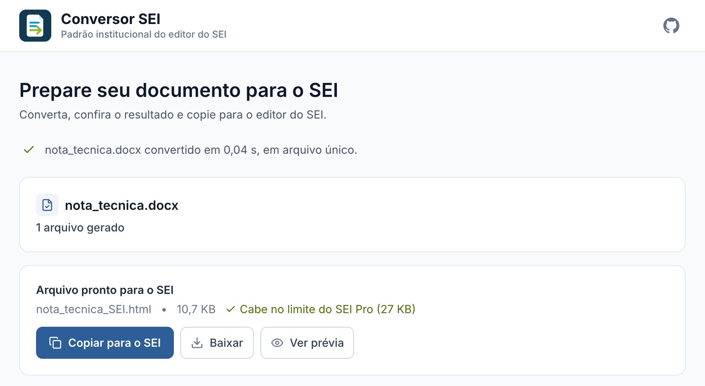
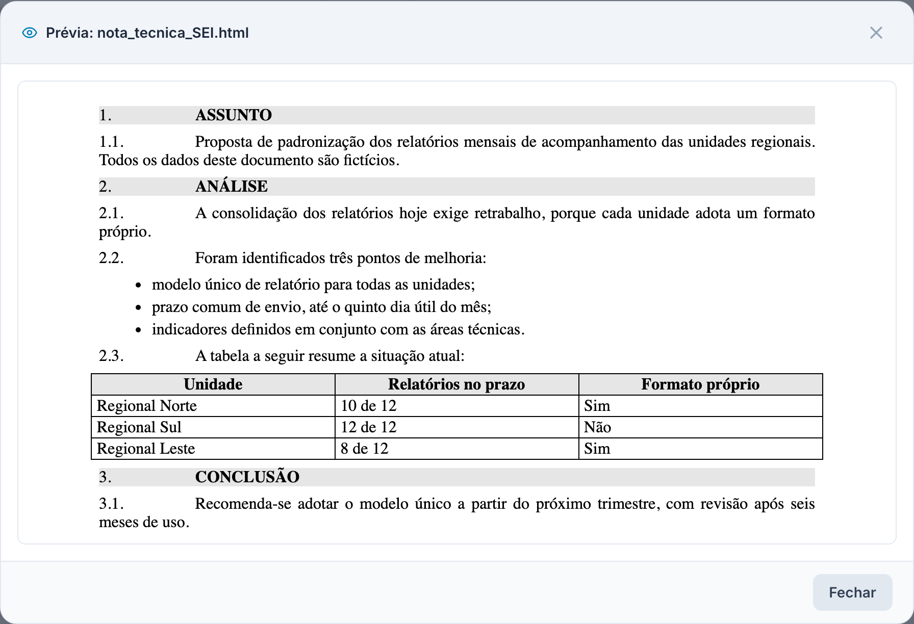

<p align="center">
  <a href="https://conversorsei.com.br/">
    
  </a>
</p>

<h1 align="center">Conversor SEI</h1>

<p align="center">
  Transforma documentos do Word, do LibreOffice e em PDF em texto pronto para colar no editor do <strong>SEI</strong>,<br>
  com a formatação e a numeração do padrão institucional.
</p>

<p align="center">
  <a href="https://conversorsei.com.br/"><strong>Abrir o conversor</strong></a>
  &nbsp;·&nbsp;
  <a href="#uso">Como usar</a>
  &nbsp;·&nbsp;
  <a href="#duvidas">Perguntas frequentes</a>
</p>

<p align="center">
  <a href="https://github.com/pancoh/conversorsei/actions/workflows/deploy-pages.yml"></a>
  <a href="LICENSE"></a>
  
</p>

<p align="center">
  
</p>

---

##  Para que serve

Quem cola um texto do Word no SEI costuma perder a formatação: a numeração se desfaz, as
tabelas ficam tortas e os parágrafos saem fora do padrão. Depois, é preciso ajustar tudo à mão.

O Conversor SEI faz esse ajuste por você. Você envia o documento, o conversor aplica os estilos
do SEI e você cola o resultado pronto no editor.

<p align="center">
  
  <br>
  <sub>Prévia de um documento convertido: títulos numerados, subitens, lista e tabela no padrão do SEI.</sub>
</p>

> **Não precisa instalar nada.** Basta abrir
> [conversorsei.com.br](https://conversorsei.com.br/) no navegador.

##  Por que usar

| Vantagem | Como funciona |
|---|---|
| **Seu documento não sai do computador** | A conversão acontece dentro do próprio navegador. Nenhum arquivo é enviado para a internet. |
| **Funciona sem internet** | Depois da primeira visita, a página abre mesmo desconectada. Também pode ser instalada como aplicativo. |
| **Numeração automática** | Itens, subitens, incisos e alíneas usam a numeração do SEI, sem repetir o número digitado no documento. |
| **Tabelas e imagens** | As tabelas saem centralizadas e com a largura do Word. As imagens vão junto com o texto. |
| **PDF digitalizado** | O reconhecimento de texto (OCR) roda no navegador. O resultado pede conferência. |
| **Documentos grandes** | Quando o texto passa do limite do SEI, o conversor divide em partes para você colar uma de cada vez. |
| **Gratuito** | Sem cadastro, sem anúncios e sem limite de uso. |

##  Formatos aceitos

| Formato | Origem comum |
|---|---|
| `.docx` | Microsoft Word |
| `.odt` | LibreOffice Writer |
| `.pdf` | PDF com texto selecionável, inclusive os exportados pelo próprio SEI |
| `.md` e `.txt` | Texto simples |

PDF digitalizado (uma foto da página) não tem texto para ler. Nesse caso, a página oferece o
botão **Reconhecer texto (OCR)**, que lê as páginas no próprio navegador, sem enviar o documento.
O texto reconhecido pode conter erros, principalmente em nomes, números e acentos: confira com o
original antes de salvar no SEI.

<a id="uso"></a>

##  Como usar

1. Abra [conversorsei.com.br](https://conversorsei.com.br/).
2. Arraste o documento para a página ou clique para escolher o arquivo.
3. Clique em **Copiar para o SEI**.
4. No SEI, abra o editor, clique no corpo do documento e cole com `Ctrl+V` (no Mac, `Cmd+V`).
5. Confira o resultado, principalmente a numeração, as tabelas e as imagens, e salve.

Se o documento foi dividido em partes, copie e cole uma parte de cada vez, na ordem indicada.

<a id="duvidas"></a>

##  Perguntas frequentes

**O conversor guarda ou lê meu documento?**
Não. O arquivo é processado no seu navegador e não é enviado a nenhum servidor.

**O cabeçalho do documento saiu repetido no SEI. O que faço?**
O SEI já gera o título, o número e o processo pelo modelo. Na página, abra
**Revisar ajustes do documento** e clique em **Omitir cabeçalho**.

**Um parágrafo não ficou com o estilo que eu queria.**
No Word ou no LibreOffice, aplique ao parágrafo um estilo com o nome exato da classe do SEI
(por exemplo, `Texto_Ementa` ou `Citação`). O conversor respeita esse nome.

**O conversor avisou que algo precisa de conferência. É um erro?**
Não. O aviso aponta o que ele não consegue garantir sozinho, como notas de rodapé. A conversão
foi feita; só confira esses pontos antes de salvar.

**Encontrei um problema. Como aviso?**
Use o link **Relatar problema** da página. Ele abre um e-mail já preenchido com a versão e o
navegador. O nome e o conteúdo do documento não vão no e-mail.

---

##  Linha de comando

Para converter muitos arquivos de uma vez, o conversor também roda no terminal. Requer Python
3.11 ou mais recente.

```bash
uv sync                                   # ou: pip install -e .

conversorsei documento.docx               # converte um arquivo
conversorsei pasta/ -o saida/ -r          # converte uma pasta e as subpastas
conversorsei                              # converte dados/entrada/ para dados/saida/
conversorsei -w                           # converte a cada arquivo salvo em dados/entrada/
conversorsei --help                       # todas as opções
```

O resultado é um arquivo `*_SEI.html`. Abra no navegador, copie tudo (`Ctrl+A` e `Ctrl+C`) e
cole no SEI.

Para testar, use o documento de exemplo:

```bash
conversorsei exemplos/nota_tecnica_exemplo.md -o dados/saida/
```

Na linha de comando, o PDF pode sair melhor que na web: quando o `pdftotext` está instalado, ele
é usado no lugar do `pypdf`.

<details>
<summary><strong>Para quem desenvolve</strong></summary>

<br>

```bash
uv run pytest -q                          # testes
uv run ruff check . && uv run mypy        # lint e tipos
uv sync --group e2e && uv run playwright install chromium webkit
uv run pytest -m e2e                      # teste no navegador (Chromium e WebKit)
```

A página publicada fica em `docs/` e roda o mesmo pacote Python no navegador, pelo Pyodide.

- Mudou algo em `conversorsei/`, `docs/app.js` ou `docs/estilos.css`: rode
  `uv run python scripts/bundle_web.py` e inclua o resultado no commit.
- Usou uma classe nova do Tailwind: recompile o CSS e rode o `bundle_web.py` de novo.

  ```bash
  npx tailwindcss@3.4.16 -c tailwind.config.js -i tailwind-input.css -o docs/estilos.css --minify
  ```

O GitHub Actions roda todas as verificações e só publica a página se elas passarem.

</details>

##  Privacidade

A página registra estatísticas anônimas de uso pelo GoatCounter, sem cookies: número de
acessos, formato dos arquivos convertidos e resultado da conversão. O nome e o conteúdo dos
documentos nunca são registrados.

##  Apoie o projeto

O Conversor SEI é gratuito. Se ele ajuda no seu trabalho, você pode apoiar pelo link
**Apoie este projeto**, no rodapé da página (Pix).

##  Licença

MIT. Veja [LICENSE](LICENSE).

---

<sub>O Conversor SEI é um projeto independente e não oficial, sem vínculo com os órgãos responsáveis pelo SEI.</sub>
